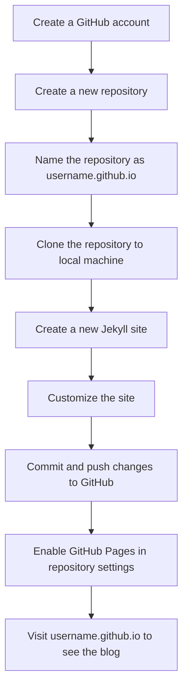

# The Post

First post

## Mermaid diagrams ? 


```mermaid
flowchart TD
    A[Create a GitHub account] --> B[Create a new repository]
    B --> C[Name the repository as username.github.io]
    C --> D[Clone the repository to local machine]
    D --> E[Create a new Jekyll site]
    E --> F[Customize the site]
    F --> G[Commit and push changes to GitHub]
    G --> H[Enable GitHub Pages in repository settings]
    H --> I[Visit username.github.io to see the blog]
```

```

```mermaid
flowchart TD
    A[Create a GitHub account] --> B[Create a new repository]
    B --> C[Name the repository as username.github.io]
    C --> D[Clone the repository to local machine]
    D --> E[Create a new Jekyll site]
    E --> F[Customize the site]
    F --> G[Commit and push changes to GitHub]
    G --> H[Enable GitHub Pages in repository settings]
    H --> I[Visit username.github.io to see the blog]
```


This is so cool !