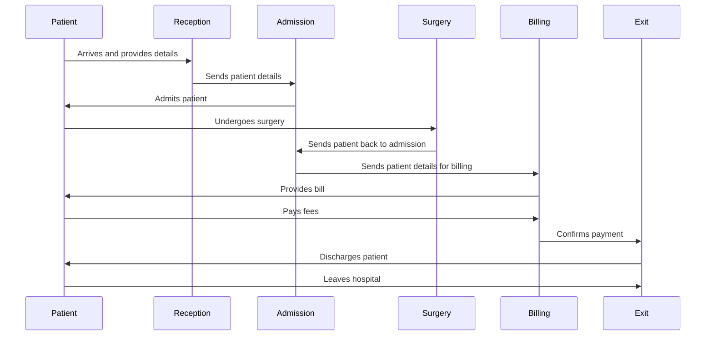

## Sequence diagrams with Mermaid syntax

```mermaid
sequenceDiagram
    participant Patient
    participant Reception
    participant Admission
    participant Surgery
    participant Billing
    participant Exit

    Patient ->> Reception: Arrives and provides details
    Reception ->> Admission: Sends patient details
    Admission ->> Patient: Admits patient
    Patient ->> Surgery: Undergoes surgery
    Surgery ->> Admission: Sends patient back to admission
    Admission ->> Billing: Sends patient details for billing
    Billing ->> Patient: Provides bill
    Patient ->> Billing: Pays fees
    Billing ->> Exit: Confirms payment
    Exit ->> Patient: Discharges patient
    Patient ->> Exit: Leaves hospital
```