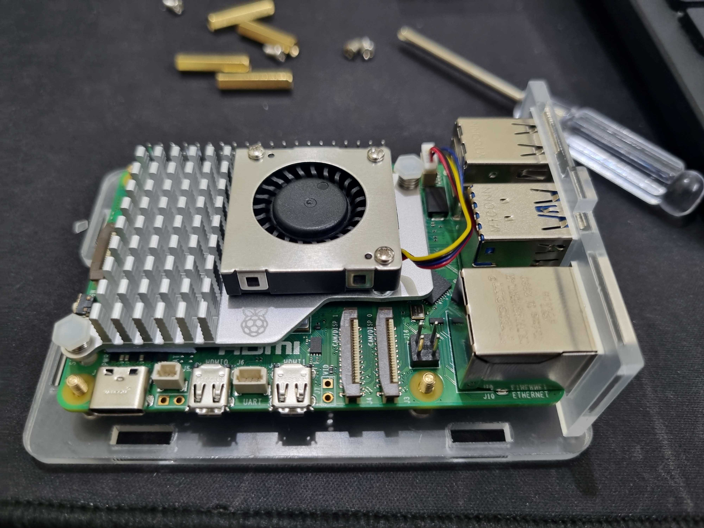

## Introduction

In this post, I will be covering the process of how I built a palm sized PC using the Raspberry Pi 5. Ofcourse its going to boot from NVMe ssd. I think its compact and cool.

`When RPI 5 got launched, out of all the features I was really excited about the dual camera ports, still looking forward to plugging dual cameras for some stereo use cases`

## Materials used

Official R-Pi components 
- Raspberry Pi 5 8GB
- Official Raspberry Pi 5 Active Cooler

Waveshare components
- 27W USB Type-C Power Supply, PD Power Supply, Suitable for Raspberry Pi 5
- Clear Acrylic Case for Raspberry Pi 5 (Supports installing Official Active Cooler)
- PCIe To M.2 HAT+ for Raspberry Pi 5

- EVM 256GB 2242 NVMe SSD




## Step-by-Step Guide

### Step 1: Prepare the MicroSD Card

1. Download the latest Raspberry Pi OS from the official Raspberry Pi website.
2. Use a tool like Balena Etcher to flash the OS image onto the MicroSD card.
3. Insert the MicroSD card into the Raspberry Pi 5.

### Step 2: Assemble the Hardware

1. Place the Raspberry Pi 5 into its case.
2. Attach the heatsinks or cooling fan to the Raspberry Pi 5.
3. Connect the HDMI cable to the Raspberry Pi and your monitor.
4. Plug in the USB keyboard and mouse.
5. Connect the power supply to the Raspberry Pi 5.

### Step 3: Initial Setup

1. Power on the Raspberry Pi 5 by plugging in the power supply.
2. Follow the on-screen instructions to complete the initial setup of the Raspberry Pi OS.
3. Connect to the internet using an Ethernet cable or Wi-Fi.

### Step 4: Install Essential Software

1. Open the terminal on your Raspberry Pi.
2. Update the package list and upgrade installed packages:
    ```sh
    sudo apt update
    sudo apt upgrade
    ```
3. Install any additional software you need, such as a web browser, office suite, or programming tools.

### Step 5: Customize Your Raspberry Pi PC

1. Change the desktop background and theme to personalize your setup.
2. Configure the system settings to your preference.
3. Install any additional peripherals or accessories you need.

## Conclusion

Congratulations! You have successfully built your own Raspberry Pi 5 PC. This compact and powerful computer can be used for a variety of tasks, from web browsing and office work to programming and media consumption. Enjoy your new Raspberry Pi 5 PC!

## Additional Resources

- [Official Raspberry Pi Documentation](https://www.raspberrypi.org/documentation/)
- [Raspberry Pi Forums](https://www.raspberrypi.org/forums/)
- [Raspberry Pi Projects](https://projects.raspberrypi.org/en/projects)