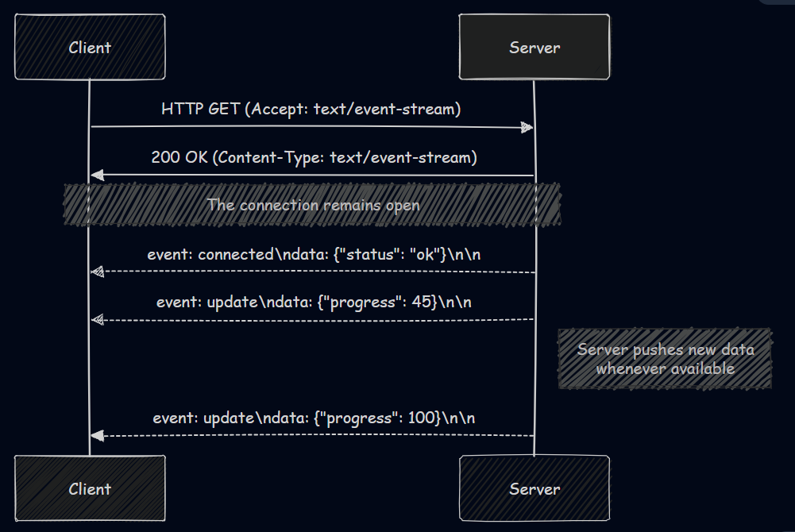
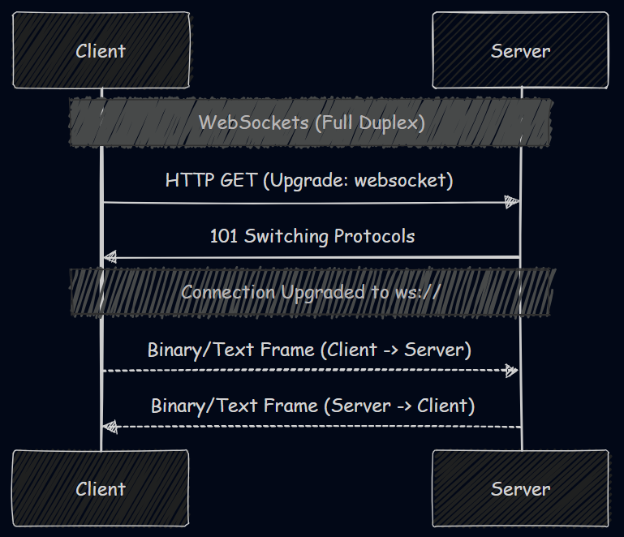

# Understanding SSE and Native Support in .NET 10
---
TL;DR - With need of optimized realtime server updates and LLM applications booming, Server-Sent Events (SSE) have become increasingly popular for streaming data from server to client. .NET 10 now offers native support for SSE, making it easier than ever to implement real-time features without the overhead of SignalR.


## What are Server-Sent Events (SSE)?

Server-Sent Events (SSE) define a powerful HTML5 standard specifically built for establishing a unidirectional, real-time connection from a server to a client. They allow web servers to push data to a requested client at any time without the client repeatedly polling for it. SSE functions over standard HTTP, making it invisible to the lower networking layers and compatible with existing load balancers and proxies.

At its core, an SSE connection is initiated by the client sending an HTTP GET request to the server. Then the server responds with a specific header: `Content-Type: text/event-stream`. This "event-stream" content type instructs the client that the response payload will not be delivered all at once. Instead, the server keeps the underlying TCP connection open and pushes text-based updates over time.



### The SSE Event Stream Format

The server sends events to the client as a continuous stream of text, separated by empty lines (represented by `\n\n`). Each event block is encoded as UTF-8 text and can include several standardized fields:

- **`data`**: The actual payload of the message. This can span multiple lines if properly prefixed.
- **`event`**: An optional identifier specifying the type of event (e.g., `update`, `alert`). This allows the client-side code to listen for specific event topics.
- **`id`**: A unique identifier for the event. This is critical for reliability; if the connection drops, the client can automatically reconnect and send a `Last-Event-ID` header, instructing the server to continue exactly where the stream broke.
- **`retry`**: Instructs the client browser on how long to wait (in milliseconds) before attempting to auto-reconnect if the connection is unexpectedly lost.

**JS Client-Side Implementation:**
Browsers natively handles SSE via the `EventSource` API.

```javascript
const source = new EventSource('/api/weather-updates');

source.onopen = (event) => console.log("Connected to SSE!");

source.addEventListener("update", (event) => {
    const data = JSON.parse(event.data);
    console.log("Weather update: ", data);
});

source.onerror = (error) => console.error("EventSource failed:", error);
```
for a .NET client implementation, see the section below.

## How is SSE Different from Long Polling and WebSockets?

Realtime web applications depend on three main techniques: Long Polling, WebSockets, or Server-Sent Events.

### 1. HTTP Long Polling
In long polling, the client makes an HTTP request, and the server intentionally holds the connection open until it has new data to send. Once the client receives the response, it immediately issues a new request.
- **Downside**: Extremely resource-intensive. Every request carries HTTP header overhead, and constantly opening and closing connections drains server resources.

### 2. WebSockets
WebSockets establish a bidirectional connection over a custom protocol (`ws://` or `wss://`), while SSE is **unidirectional** (server to client only) and runs entirely over standard HTTP (`http://` or `https://`). 



Here are the key differences between WebSockets and SSE:
1. **Directionality:** WebSocket's bidirectional nature allows both the client and server to push messages at any time. SSE only allows the server to push data downstream to the client.
2. **Protocol and Data:** WebSockets require a protocol upgrade and support binary data transmission natively (its a different protocol altogether). SSE is standard HTTP and exclusively transmits text data (like JSON or plain text).
3. **Reconnection & State:** SSE features native browser support using event-source APIs but requires some implementation for other headless environments. With WebSockets, you must manually implement custom reconnection logic and message acknowledgment mapping.
4. **Proxy/Firewall Compatibility:** SSE simplifies infrastructure. Because it relies on standard HTTP, corporate firewalls, load balancers, and proxy servers handle it flawlessly. WebSockets can sometimes be blocked or unexpectedly dropped by aggressive intermediaries like load balancers or reverse proxies.

## Why is SSE popular now?

In the real-time web with most recently, streaming responses from Large Language Models (LLMs) in AI applications. The rise of Large Language Models (LLMs) and AI chatbots (like ChatGPT) has led to an increase in SSE's popularity. 

When you prompt an LLM, generating the full response can take several seconds to a minute. If the application used a standard HTTP request, the user would stare at a loading spinner for the entire duration, creating a poor UX. 

Instead, LLM chat applications use SSE to stream the LLM's response token-by-token (or word-by-word) as it's being generated. The client receives these chunks in real-time, creating the familiar "typing" effect that keeps the user engaged. SSE is the perfect fit for this: the client makes one request, and the server pushes multiple small pieces of text linearly back to the client.

## Native SSE Support in .NET 10

Building real-time functionality in ASP.NET Core meant that developers relied on **SignalR**.

While SignalR is effective at abstracting the transport layer (WebSockets, SSE, or Long Polling) and offering hubs, groups, and bidirectional RPC—it can be overkill for simple server-to-client updates. SignalR requires heavy client libraries and establishes bidirectional communication even when you only need to broadcast.

With **.NET 10**, first-class support for Server-Sent Events is available right into the core framework. There is no longer a need for SignalR or complex custom middleware for simple server-to-client streaming. 

.NET 10 provides `TypedResults.ServerSentEvents` (or `Results.ServerSentEvents`), which seamlessly integrates with `IAsyncEnumerable<T>`, letting you stream data items incrementally as they become available.

## Implementing SSE in .NET 10: A Pokémon Example

Let's look at an example where a server streams random Pokémon to a client.

### The Server-Side Implementation

First, the simple model `Pokemon.cs`:

```csharp
namespace ServerSentEvents
{
    public class Pokemon
    {
        public string Name { get; set; }
        public string Type { get; set; }
    }
}
```

Then, the controller `PokemonController.cs` that handles the SSE request:

```csharp
using Microsoft.AspNetCore.Mvc;
using System.Runtime.CompilerServices;

namespace ServerSentEvents.Controllers
{
    [ApiController]
    [Route("[controller]")]
    public class PokemonController : ControllerBase
    {
        private static readonly string[] PokemonNames =
            ["Bulbasaur", "Charmander", "Squirtle", "Pikachu", "Eevee"];

        [HttpGet("PokeeGet")]
        public IResult PokeeGet(CancellationToken cancellationToken)
        {
            // Returns an SSE stream directly from an IAsyncEnumerable
            return TypedResults.ServerSentEvents(GeneratePokemon(cancellationToken));
        }

        private static async IAsyncEnumerable<Pokemon> GeneratePokemon(
            [EnumeratorCancellation] CancellationToken ct)
        {
            var random = new Random();
            var counter = 1;

            while (!ct.IsCancellationRequested)
            {
                yield return new Pokemon
                {
                    Name = $"{PokemonNames[random.Next(PokemonNames.Length)]} #{counter++}",
                    Type = random.Next(2) == 0 ? "Fire" : "Water"
                };

                // Wait 1 second before yielding the next item
                await Task.Delay(1000, ct);
            }
        }
    }
}
```

**How it works:**
- `GeneratePokemon` is an async iterator returning an `IAsyncEnumerable<Pokemon>`. It runs an infinite loop, yielding a new Pokémon object every second until the client drops the connection (triggering the `CancellationToken`).
- The `[HttpGet]` endpoint passes this enumerable to `TypedResults.ServerSentEvents()`. The framework natively sets the `Content-Type: text/event-stream` header and securely streams each JSON-serialized object following the exact SSE specifications.

### The Client-Side Implementation

Parsing an SSE stream is completely native again in .NET 10 console applications through the `System.Net.ServerSentEvents` namespace. It provides a native `SseParser` that does the heavy lifting of reading the event stream network chunks.

Here is how the console client (`Program.cs`) connects to the stream and parses the events:

```csharp
using System.Net.ServerSentEvents;
using System.Text.Json;

// Accept localhost dev certificates
var handler = new HttpClientHandler
{
    ServerCertificateCustomValidationCallback = 
        HttpClientHandler.DangerousAcceptAnyServerCertificateValidator
};

using var httpClient = new HttpClient(handler);
var url = "https://localhost:XXXX/Pokemon/PokeeGet";
using var cts = new CancellationTokenSource();

Console.WriteLine("🔌 Connecting to Pokemon SSE stream...");

// Send request. ResponseHeadersRead is crucial, so we don't wait for the infinite body to buffer!
using var request = new HttpRequestMessage(HttpMethod.Get, url);
using var response = await httpClient.SendAsync(
    request,
    HttpCompletionOption.ResponseHeadersRead,
    cts.Token);

response.EnsureSuccessStatusCode();
Console.WriteLine($"✅ Connected! Status: {response.StatusCode}\n");

// Get the actual network stream
await using var stream = await response.Content.ReadAsStreamAsync(cts.Token);

// Create a typed SseParser that turns JSON bytes into our Pokemon record
var parser = SseParser.Create(stream, (eventType, bytes) =>
{
    return JsonSerializer.Deserialize<Pokemon>(bytes, new JsonSerializerOptions 
    { PropertyNameCaseInsensitive = true })!;
});

// Asynchronously enumerate items as they stream in
await foreach (var sseItem in parser.EnumerateAsync(cts.Token))
{
    var pokemon = sseItem.Data; // Typed as Pokemon
    Console.WriteLine($"Received {pokemon.Name} (Type: {pokemon.Type}), EventType: {sseItem.EventType}");
}

record Pokemon(string Name, string Type);
```

**Client breakdown:**
1. **`HttpCompletionOption.ResponseHeadersRead`:** This is needed and It instructs the `HttpClient` to return control to us right after reading the HTTP headers, rather than waiting for the entire body to download.
2. **`SseParser.Create`:** We pass the raw network stream and a custom delegate that deserializes the incoming raw JSON bytes into our `Pokemon` model.
3. **`parser.EnumerateAsync()`:** We can iterate over the elements using `await foreach`. Each loop block provides an `SseItem<Pokemon>`, which contains the parsed data, the assigned event-type from the server, and any possible ID's or `ReconnectionInterval` hinting the server provided.
4. **Auto-Reconnect:** `SseParser` just handles stream parsing, we should implement our own reconnection logic if the connection drops. This typically involves catching exceptions, waiting a few seconds, and re-issuing the request. **Probably will try out in the future and update the article with a robust reconnect example**.

## Conclusion

Server-Sent Events provides a lightweight, standardized, and clean approach to  real-time data streaming from server to client. While WebSockets and SignalR are ideal two-way communications, SSE is perfectly suited for single-direction data feeds such as notifications, live dashboards, and of course, LLM response streaming. 


With .NET 10 seamlessly introducing native support by combining `TypedResults.ServerSentEvents` with `System.Net.ServerSentEvents`, building robust server and client streaming capabilities in C# has never been more enjoyable.
